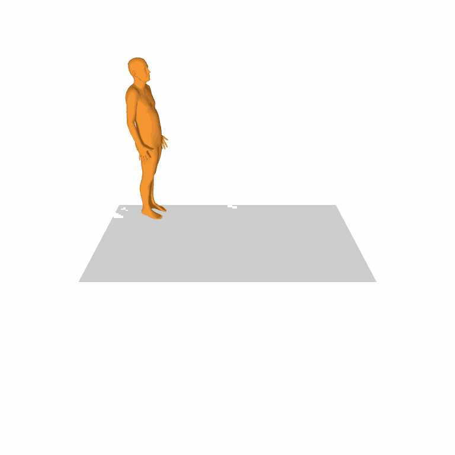
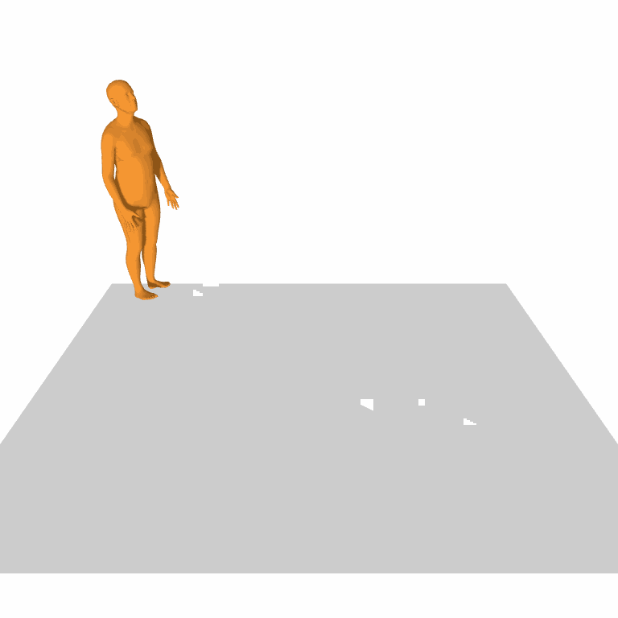
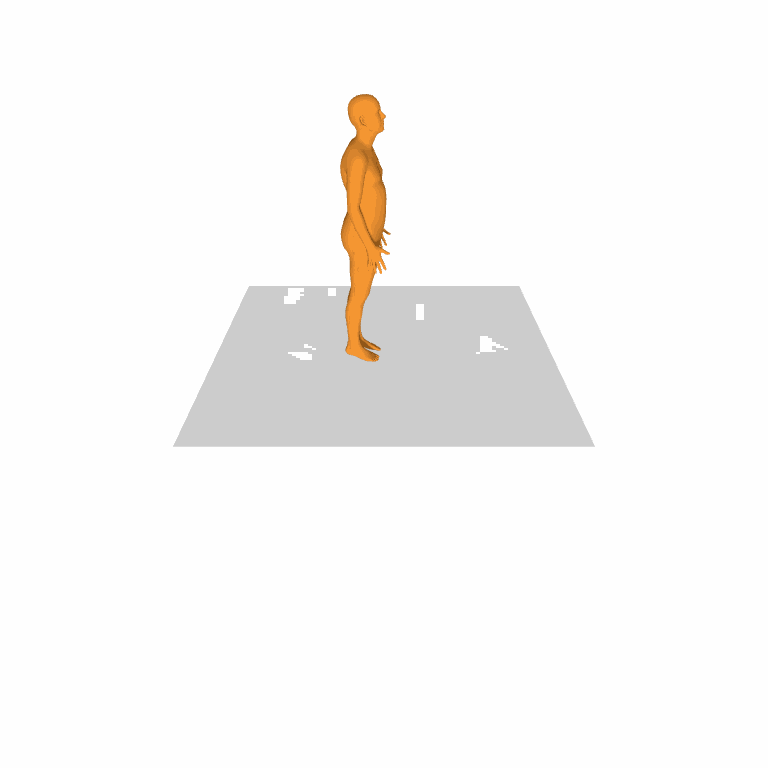

# Text-to-Action-to-Motion

  <table>
    <tr>
      <td align="center" width="50%">
        
         
        <em>a person walks forward slowly.</em>
      </td>
      <td align="center" width="50%">
        
         
        <em>a person walks forward fast.</em>
      </td>
    </tr>
  </table>
  
  <table>
    <tr>
      <td align="center" width="50%">
        
         
        <em>a person is walking in a circle</em>
      </td>
    </tr>
  </table>

